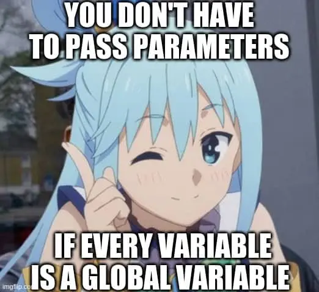

<table width="100%">
  <tr>
    <td width="60%" valign="top">
      
       
      <picture>
        <source media="(prefers-color-scheme: dark)" srcset="https://raw.githubusercontent.com/abozanona/abozanona/output/pacman-contribution-graph-dark.svg">
        <source media="(prefers-color-scheme: light)" srcset="https://raw.githubusercontent.com/abozanona/abozanona/output/pacman-contribution-graph.svg">
        
      </picture>
    </td>
    <td width="40%" valign="top">
      
    </td>
  </tr>
</table>

  

<table width="100%" cellpadding="0" cellspacing="0" border="0"><tr><td colspan="2" align="center"></td></tr>
<tr>
    <td width="55%" valign="top"> </td>
    <td width="45%" valign="top"> </td>
  </tr>
</table>

 
<table width="100%" align="center">
  <tr>
    <td width="55%" valign="top">
      

        Linux |
        Web development |
        AI development |
        Games and Software
      

      

        <strong>I play games a lot, ok maybe not a lot</strong>
      

    </td>
  </tr>
</table>

<h3 align="center"><em>Connect with Me</em></h3>

  &nbsp;&nbsp;
  &nbsp;&nbsp;
  &nbsp;&nbsp;
  

<h3 align="center"><em>Tech Stack</em></h3>

                         

